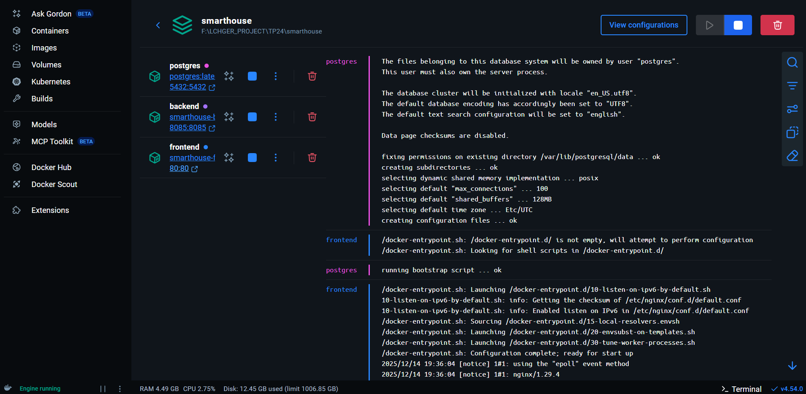
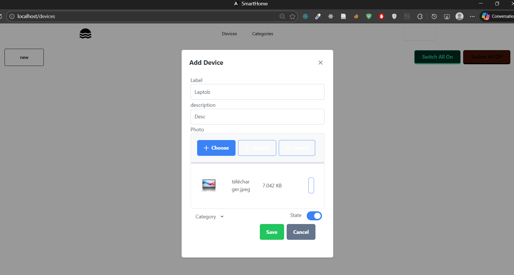
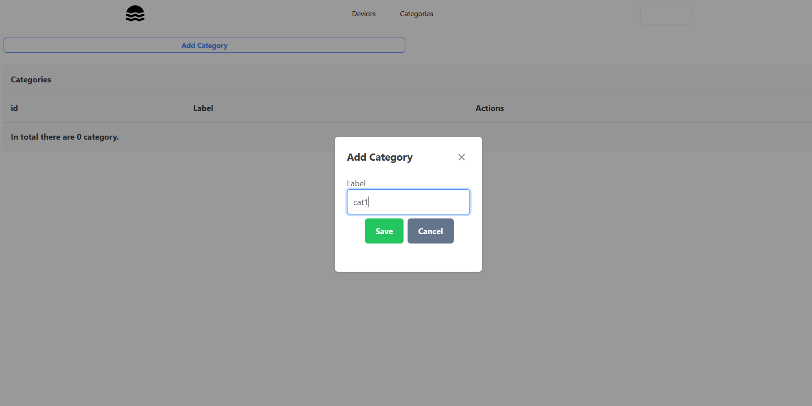

# Smart House - Conteneurisation Spring + Angular

Application de gestion de maison intelligente avec backend Spring Boot et frontend Angular, déployée via Docker.

## Stack

- Spring Boot (Java 17) - API REST
- Angular - Interface utilisateur
- PostgreSQL - Base de données
- Docker Compose - Orchestration

## Lancement

```bash
docker-compose up --build
```

**URLs:**

- Frontend: http://localhost:80
- Backend: http://localhost:8085
- PostgreSQL: localhost:5432

## Screenshots





## Fonctionnalités

- Gestion des appareils connectés
- Organisation par catégories
- CRUD complet via API REST

## Base de données

**Connexion PostgreSQL:**

- Database: `smart-house`
- User: `postgres`
- Password: `root`
- Port: 5432

Le schéma est créé automatiquement par Hibernate au démarrage.

## Services Docker

| Service  | Port | Description         |
| -------- | ---- | ------------------- |
| frontend | 80   | Application Angular |
| backend  | 8085 | API Spring Boot     |
| postgres | 5432 | Base de données     |
